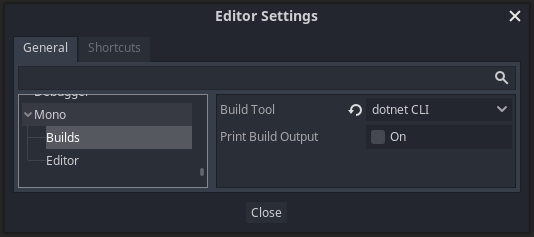

# GodotOnReady

**GodotOnReady** is a [C# Source Generator] that adds convenient `onready`-like
features to your C# scripts in Godot Mono without any reflection.

* [`[OnReadyGet]`](#onreadyget) - Load a `Node` or `Resource` subclass into a
  field or property. Automatically exports a property so you can use the Godot
  editor to configure the path it loads.
* [`[OnReady]`](#OnReady) - Execute any 0-argument method during `_Ready`.

Bonus feature:

* [`[GenerateDataSelectorEnum]`](docs/GenerateDataSelectorEnum.md) - Generate an enum
  where each value is strongly associated with custom data.

## Prerequisites

* Godot 3.2.3 or greater (Mono version) (3.3+ recommended)  
  <https://godotengine.org/download>

* .NET SDK 5.0 or greater  
  <https://dotnet.microsoft.com/download>

* Set Godot to use the `dotnet CLI` Build Tool  
  <details><summary>Screenshot showing this editor setting (click me!)</summary>

  

  </details>

## Project setup

Just add the [`GodotOnReady`](https://www.nuget.org/packages/GodotOnReady)
NuGet package to your project! `GodotOnReady` adds two components: a C#
library with a few attributes, and a source generator that detects those
attributes and generates code.

Your Godot project's `.csproj` file should look like this when you're done:

```xml
<Project Sdk="Godot.NET.Sdk/3.3.0">
  <PropertyGroup>
    <TargetFramework>net472</TargetFramework>
  </PropertyGroup>
  <ItemGroup>
    <PackageReference Include="GodotOnReady" Version="1.1.3" />
  </ItemGroup>
</Project>
```

You may need to restart your IDE to navigate to generated sources and for the
generated code to show up in code completion/intellisense.

For advanced alternatives like building from source or avoiding a reference
to `GodotOnReady.Attributes`, see
[/docs/advanced-setup.md](/docs/advanced-setup.md).

## Usage

### `[OnReadyGet]`

Instead of writing this repetitive code:

```cs
public class MyControl : Control
{
  [Export] public NodePath ButtonPath { get; set; }
  private Button _button;

  public override void _Ready()
  {
    _button = GetNode<Button>(ButtonPath);
  }
}
```

Write this code instead to do the same thing:

```cs
public partial class MyControl : Control
{
  [OnReadyGet] private Button _button;
}
```

The source generator figures out that the exported property should be called
`ButtonPath` by taking `_button`, trimming the leading `_` character, and
capitalizing the first letter.

The `[OnReadyGet]` source generator works for fields and properties. It also
works for `Resource` subclasses like `PackedScene` and `Texture`. You can also
use an `interface`, in which case GodotOnReady assumes the interface is
implemented by a node.

### `[OnReadyGet(...)]`

If you pass a string to the attribute, it's used as the node path to get. The
`[Export]` `ButtonPath` property isn't generated. This is useful if you know the
node will always be at a certain path, and avoids cluttering the Godot editor
with exported properties you'll never use:

```cs
[OnReadyGet("My/Button/Somewhere")] private Button _button;
```

If you know the node will usually be at one path, but someone may need to tweak
it in the Godot editor to point somewhere else, set `Export = true`. This sets
the string as the default path, and *also* exports `ButtonPath` for tweaking in
a scene:

```cs
[OnReadyGet("My/Button/Somewhere", Export = true)] private Button _button;
```

To get a node if it exists and ignore issues, pass `OrNull = true`. This means
GodotOnReady does nothing if the the path is `null`, empty, invalid, or points
at the wrong type of node. Normally, it throws an exception in these cases.

If you use `OrNull = true`, the `_button` member may be null, so be sure to
check before using it!

```cs
[OnReadyGet("My/Button/Maybe", OrNull = true)] private Button _button;
```

If your property is a `Resource` rather than a `Node`, pass a resource path
instead of a node path:

```cs
[OnReadyGet("res://icon.png")] private Texture _tex;
```

To get a property of a node instead of getting the node itself, specify
`Property = "..."`. GodotOnReady will cast the result for you, so this is
particularly useful for properties that aren't exposed in the statically-typed
Godot C# API.

For example, you can get an animation tree playback object without calling
`.Get("...")` and casting the result yourself:

```cs
[OnReadyGet("AnimationTree", Property = "parameters/playback")]
private AnimationNodeStateMachinePlayback _playback;
```

---

### `[OnReady]`

Using `OnReadyGet` causes GodotOnReady to generate a `public override void
_Ready()` method. This means you can't define `_Ready()` yourself. To run your
own code during `_Ready`, mark any number of zero-argument methods with
`[OnReady]`:

```cs
[OnReadyGet] private Button _button;
[OnReady] private void ConnectButtonOnReady()
{
  _button.Connect("pressed", this, nameof(ButtonPressed));
}
```

The generated `_Ready()` method will then be:

```cs
public override void _Ready()
{
  _button = GetNode<Button>(ButtonPath);
  ConnectButtonOnReady();
}
```

### `[OnReady(...)]`

There is only one argument, `Order`. It lets you change the sort order for
`OnReady` methods. The default is `0`.

`OnReady` calls are sorted with this priority:
* (1) `Order`, from low to high.
* (2) Declaration order in the class file.

All `OnReadyGet` members are initialized between the last `Order=-1` method and
the first `Order=0` method.

---

# Troubleshooting

### error CS0111: Type '***' already defines a member called '_Ready' with the same parameter types

When you use `[OnReadyGet]`, you can't write `public override void _Ready()` in
your own code, because GodotOnReady generated it already. To run your own code
in the generated `_Ready()` method, use [`[OnReady]`](#OnReady).

### error CS0260: Missing partial modifier on declaration of type '***'; another partial declaration of this type exists

Your class is most likely missing the `partial` modifier. The declaration
should look like this:

```cs
public partial class MyNode : Node
```

### I don't have a error message, but it isn't working!

* My variables are null even though they have `[OnReadyGet]` attributes!
* `[OnReady]` methods aren't being called!
* The `Path` properties don't show up in Godot!

If you hit one of those issues, it probably means the source generator didn't run.
Try these steps:

1. Hit the `Build` button at the top-right of the Godot editor to make sure your build is up to date.
1. Make sure you are using [.NET SDK version 5.0](#Prerequisites) or newer.
1. Make sure your [Build Tool is set to `dotnet CLI`](#Prerequisites).
1. Are you seeing a problem in a CI build, even though it works fine on your own machine? [Your CI may be using a Mono SDK](https://github.com/abarichello/godot-ci/issues/80). Make sure it's using the .NET SDK.

If none of that works, please file an issue. Include the output of
running `dotnet --info` on the command line, the Godot build log,
and if possible, the project.

# License

GodotOnReady is licensed under the [MIT license](LICENSE).


[C# Source Generator]: https://devblogs.microsoft.com/dotnet/new-c-source-generator-samples/
